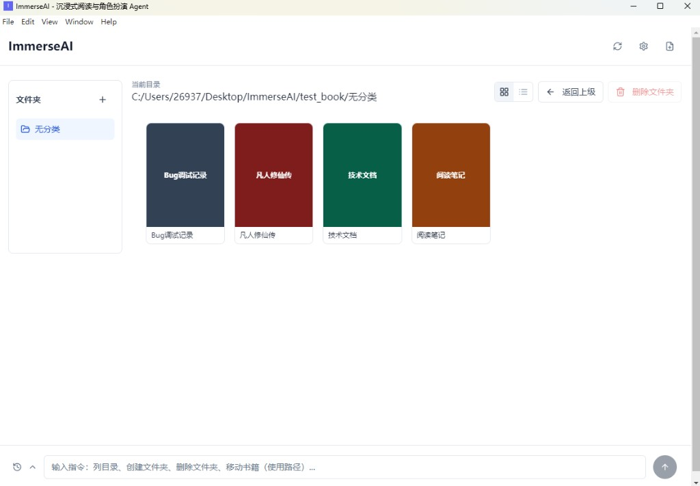

# ImmerseAI

> 把书里的人物请出来，和他们聊天。



ImmerseAI 是一款 **Local-First** 桌面应用。通过 MCP 协议接管本地书库，在设备端完成 RAG 向量化，生成书中角色的人设并进行沉浸式对话。所有书籍与向量索引永远留在本地，唯一出站的只有你主动发起的 LLM 请求。

---

## 功能概览

| 功能 | 说明 |
|------|------|
| **本地书架** | 挂载任意本地目录，自动扫描 `.md` / `.txt`，支持多层文件夹结构 |
| **宫格 / 列表视图** | 可切换两种书架布局，拖动窗口自适应响应式排版 |
| **端侧 RAG** | 自适应分块 + 主进程 embedding（all-MiniLM-L6-v2）+ Orama BM25，混合 RRF 检索 |
| **两阶段索引** | 大书（> 5000 chunks）立即完成词法索引可用，后台异步升级语义 |
| **角色人设** | 用 LLM + RAG 检索自动生成角色描述、性格、台词风格、背景 |
| **沉浸式对话** | 流式输出 + RAG 上下文注入，回应附带原文引用，点击跳回原文 |
| **Librarian Agent** | 自然语言指挥文件管理：移动书籍、创建/删除文件夹、批量操作 |
| **页面过渡动画** | framer-motion 全局路由过渡 + 阅读器骨架屏，消除白屏体验 |
| **安全存储** | API Key 通过 Electron `safeStorage` 加密，不写入任何明文文件 |

---

## 技术栈

| 层级 | 技术选型 |
|------|---------|
| 运行时 | Electron 28 |
| 前端 | React 18 + TypeScript strict |
| 构建 | Vite 5 + electron-vite |
| UI | TailwindCSS 3 + shadcn/ui + framer-motion |
| 全局状态 | Zustand 4 + persist middleware |
| Agent 协议 | @modelcontextprotocol/sdk（Stdio transport） |
| 端侧 RAG | @huggingface/transformers（主进程 Node.js）+ @orama/orama |
| LLM | OpenAI Compatible API，用户自定义 Base URL / Model |

**架构分层**：渲染进程（React UI）→ 主进程（RAG + IPC 桥接 + MCP）→ 外部（LLM API）

RAG 向量化在主进程 Node.js 中执行，规避渲染进程 `file://` 协议限制；UI 层通过 IPC fire-and-forget 异步获取进度，始终不阻塞界面。

---

## 快速开始

```bash
npm install
npm run dev      # 开发模式（热重载）
npm run build    # 类型检查 + 构建
npm run pack     # electron-builder 打包为安装包
```

首次启动后，在**设置页**填入 API Key、Base URL 和 Model 名称，然后点击书架页的目录按钮选择本地文件夹挂载书架。配置通过 Zustand persist 缓存，重启后自动恢复。

---

## 项目结构

```
immerseai/
├── electron/
│   ├── main/          # ipc-handlers · llm-handler · rag-handler · mcp-manager · safe-storage
│   └── preload/       # contextBridge 安全 API（白名单 channel）
├── src/
│   ├── app/           # 路由（PageTransitionLayout）· Provider
│   ├── features/      # bookshelf · reader · chat · persona · settings
│   └── shared/        # 通用组件 · Store · 类型 · hooks · utils
├── openspec/          # 规格驱动开发文档与归档变更
└── test_book/         # 调试记录（Bug调试记录.md）与测试样本
```

---

## 开发进度

> 更新：2026-03-07

| Phase | 内容 | 状态 |
|-------|------|------|
| 1 基建 | IPC 桥接 / Zustand Store / 路由 / 类型系统 | ✅ |
| 2 书架 | MCP Manager / BookshelfPage / Librarian Agent / 响应式布局 / 宫格+列表视图 | ✅ |
| 3 大脑 | RAG 主进程迁移 / 自适应分块 / 两阶段索引 / 混合 RRF 检索 / 并发去重 | ✅ |
| 4 灵魂 | LLM 流式对话 / Chat UI / 角色人设生成 / 阅读器 / 引用跳转 / 骨架屏 | ✅ |
| 5 质量 | React 最佳实践审查 / 性能优化 / Bug 调试体系 / 打包发布 | ✅ |

---

## 工程实践

**OpenSpec 规格驱动开发**：每个功能变更遵循 `proposal → design → specs → tasks → apply → verify → archive` 流程，变更文档归档于 `openspec/changes/archive/`。

**测试体系**：`qoobee-t&f-skill` 支持自动化代码审计（AT-01 ~ AT-14）与人工测试报告修复。AT-01 ~ AT-14 全部通过。

**Bug 调试记录**：每个 Bug 均记录根因分析、代码 diff、知识点与面试问答，维护于 `test_book/无分类/Bug调试记录.md`（当前 BUG-001 ~ BUG-007）。

**Agent Skills**：`.cursor/skills/` 内置测试修复、Bug 调试记录、Vercel React 最佳实践等能力包，关键词触发，不影响核心运行链路。
