现在我已经充分了解了 Nano Banana Pro 的 UI prompt 写法最佳实践。让我根据你的宪法文档，为 ImmerseAI 的每个页面/状态编写高质量的 Nano Banana 图片生成 Prompt。

---

# 🎨 ImmerseAI — Nano Banana Pro UI 生成 Prompt 全集

> **使用说明**：以下每个 Prompt 直接复制到 Google AI Studio（选择 Nano Banana Pro / Gemini 2.5 Flash Image）中生成。生成的图片将作为你开发时的视觉参考（Design Reference），不是最终交付物。
>
> **Prompt 编写策略**：
>
> - 采用 Nano Banana Pro 擅长的 **"Mock Window"** 格式（带窗口边框的桌面应用截图）
> - 统一 Notion 极简风格：黑白灰色调、Inter 字体、无渐变
> - 每个 prompt 包含：**应用类型 → 窗口结构 → 布局细节 → 交互状态 → 设计约束**

---

## Prompt 1：书架主页 — 默认空状态（首次启动）

```
Generate a high-fidelity UI screenshot of a desktop application window called "ImmerseAI".

WINDOW FRAME: macOS-style window chrome with three traffic light buttons (red, yellow, green) at top-left. Window title bar is minimal with no text. The window size is approximately 1440×900 pixels.

LAYOUT:
- TOP BAR: A thin horizontal header bar. Left side shows the text logo "ImmerseAI" in bold Inter font, slate-900 color. Right side has three small icon buttons in a row: a gear icon (Settings), a download/import icon (Import Book), and a GitHub icon (Sync), all in slate-500 color with subtle hover-friendly spacing.

- MAIN CONTENT AREA: The center of the screen is an empty state. A large light-gray dashed border rectangle sits centered in the middle. Inside the dashed rectangle, there is a book icon (outline style, slate-300 color) and below it the text "Drag & drop EPUB files here, or click Import to get started" in slate-400 color, font size 14px. Below the text, a subtle button labeled "+ Add Your First Book" with a slate-200 border and slate-600 text.

- BOTTOM BAR: A fixed bottom section approximately 80px tall, separated by a thin slate-200 border-top line. Contains a wide text input field spanning most of the width with a placeholder text "Ask Librarian to organize books or find a document..." in slate-400 italic. On the right side of the input, a small circular send button with an arrow-up icon in slate-800.

DESIGN STYLE: Notion-inspired minimalism. Background is pure white (#FFFFFF). All text uses Inter font. No gradients, no drop shadows except a very subtle shadow-sm on the bottom bar. Monochrome palette only: white, slate-50, slate-200 borders, slate-500 secondary text, slate-900 primary text.

OUTPUT: A single realistic desktop application screenshot. Clean, professional, pixel-perfect.

```
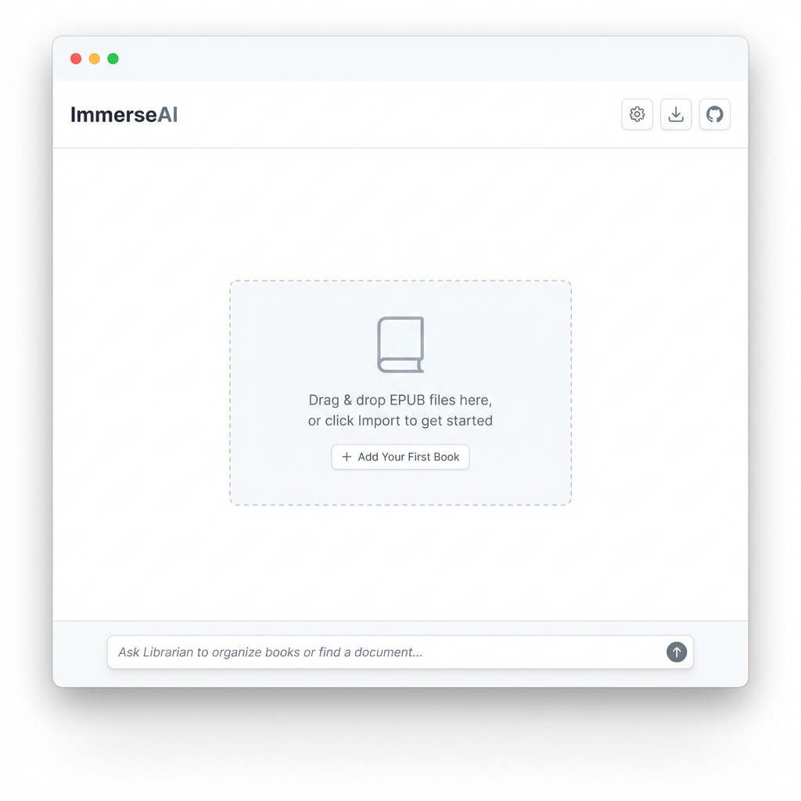

---

## Prompt 2：书架主页 — 已加载书籍（正常状态）

```
Generate a high-fidelity UI screenshot of a desktop application window called "ImmerseAI" showing a bookshelf dashboard with books loaded.

WINDOW FRAME: macOS-style window chrome with traffic light buttons at top-left. Window size 1440×900.

LAYOUT:
- TOP BAR: Left: bold text "ImmerseAI" in slate-900. Right: three icon buttons (Settings gear, Import arrow-down, GitHub octocat) in slate-500, evenly spaced.

- MAIN CONTENT (scrollable grid):
  A responsive CSS grid with 5 columns of book cards. Show 8 books total (5 in row 1, 3 in row 2 plus an empty "+" add card).

  Each BOOK CARD:
  - Aspect ratio 2:3 (portrait, like a real book cover).
  - The cover area has a colored background simulating book covers: use muted tones like deep navy, burgundy, forest green, warm gray, dark teal.
  - On each cover, show a book title in white text (centered, bold): "三体", "活着", "百年孤独", "红楼梦", "1984", "人类简史", "小王子", "鲁迅全集".
  - Below each cover: book title in slate-900 (14px, semibold) and author name in slate-500 (12px, normal).
  - Cards have a 1px slate-200 border, rounded-lg corners, white background.
  - One card (the second one) shows a subtle blue-ish border highlight as if hovered.

  The last position in the grid is an "Add Book" card: dashed slate-300 border, a large "+" icon in the center, text "Add Book" below in slate-400.

- BOTTOM BAR (fixed):
  Separated by a 1px slate-200 border-top. A glass-morphism-like very subtle slate-50 background.
  Contains a wide input field with rounded-lg border. Placeholder: "Ask Librarian to organize books or find a document...". A small robot emoji "🤖" before the placeholder text. Send button on the right with an arrow-up icon.

DESIGN STYLE: Ultra-clean Notion-like minimalism. White background, monochrome slate palette. Inter font family. No gradients. No heavy shadows. Content-focused with generous whitespace. The overall feeling is calm, focused, and elegant.

OUTPUT: A single realistic desktop app screenshot, pixel-perfect, high resolution.

```
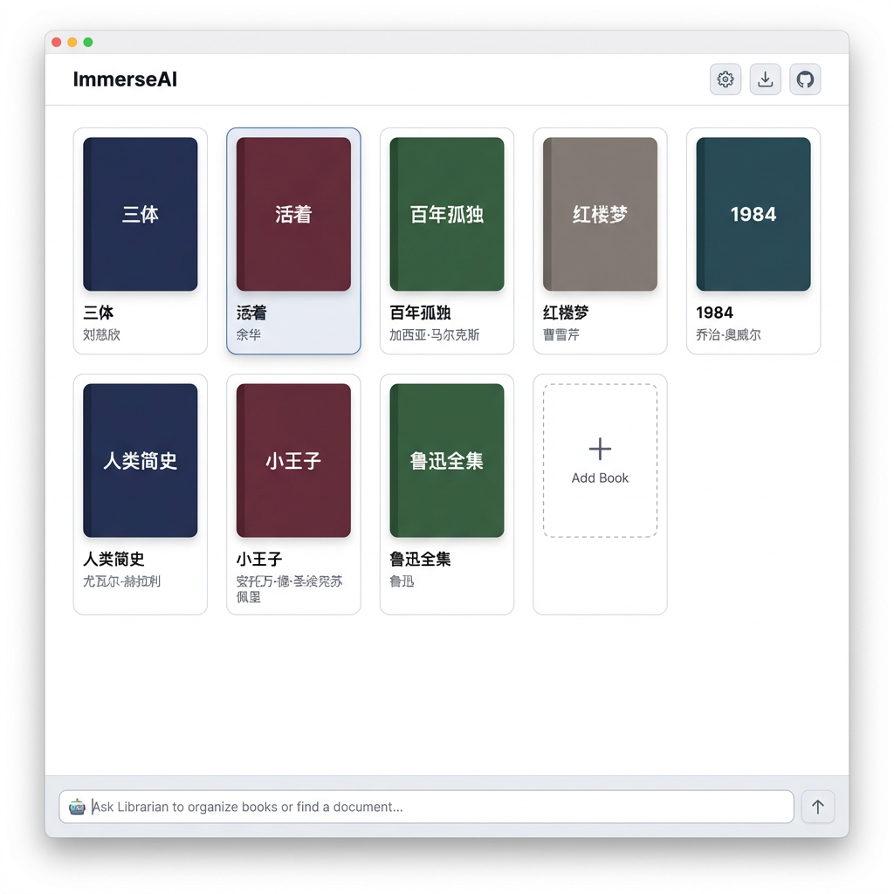

---

## Prompt 3：书架主页 — Librarian Agent 正在执行命令

```
Generate a high-fidelity UI screenshot of the "ImmerseAI" desktop application showing the Librarian AI agent actively processing a command.

WINDOW FRAME: macOS-style, 1440×900.

LAYOUT:
- TOP BAR: Same as before — "ImmerseAI" logo left, icon buttons right.

- MAIN CONTENT: Book grid with 8 books displayed (same as Prompt 2). Two of the books ("三体" and "三体II：黑暗森林") have a subtle animated-looking dashed blue outline around them, indicating they are being selected/moved by the agent.

- BOTTOM BAR (expanded to ~200px, showing conversation):
  The bottom section has expanded upward to show a mini chat history:

  Message 1 (user bubble, right-aligned): "把所有三体系列放到 Sci-Fi 文件夹" — in a light slate-100 background bubble, slate-900 text.

  Message 2 (assistant bubble, left-aligned): "好的，我找到了 2 本三体系列书籍。正在将它们移动到 Sci-Fi 文件夹..." — with a small robot avatar (🤖) on the left. Below the text, show a small progress indicator: "Moving 1/2..." with a thin slate-800 progress bar at about 50%.

  At the bottom of the expanded area, the input field is still present with the send button.

DESIGN STYLE: Notion-minimal. The expanded chat area has a very subtle slate-50 background to differentiate from the white main content. The selected books have a dashed blue (slate-600) animation border. All else remains monochrome. The feeling is that an AI agent is actively working — purposeful and transparent.

OUTPUT: A single realistic desktop app screenshot.

```
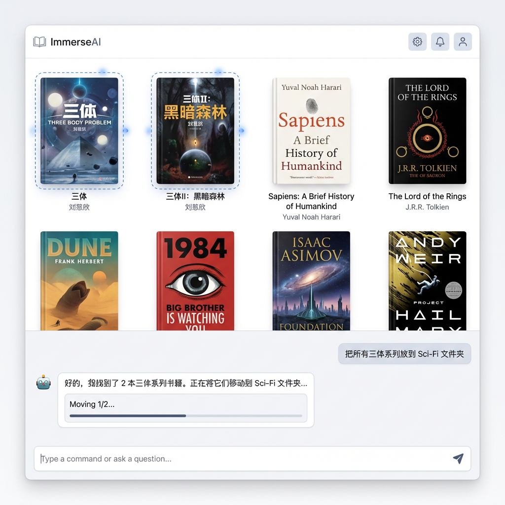

---

## Prompt 4：阅读页 — 阅读模式 (Read Mode)

```
Generate a high-fidelity UI screenshot of the "ImmerseAI" desktop application in Reader View, showing an EPUB book being read.

WINDOW FRAME: macOS-style, 1440×900.

LAYOUT:
- HEADER BAR (compact, ~48px height):
  - Left: A back arrow icon "←" with text "Back" in slate-500.
  - Center: Book title "《三体》" in slate-900, font-semibold, 16px.
  - Right: Two buttons side by side:
    1. A user-cog icon button labeled "Persona" in slate-500.
    2. A mode toggle: two small tab-like buttons — a book icon (currently active, filled slate-900 background with white icon) and a message-bubble icon (inactive, slate-300). This shows the current mode is "Read".

- MAIN CONTENT (full width, centered reading area):
  A clean book reading layout, like a Kindle reader or Apple Books. The text content area is centered with max-width ~700px, generous padding on both sides.

  Show Chinese text content simulating a passage from a science fiction novel:
  "面壁者罗辑最终明白了黑暗森林法则的真正含义。宇宙就是一座黑暗森林，每个文明都是带枪的猎人，像幽灵般潜行于林间，轻轻拨开挡路的树枝..."

  The text is in slate-800, 18px, line-height 1.8, serif-style font for reading comfort. Chapter title "第二十三章 黑暗森林" is shown at the top of the reading area in slate-900, bold, 22px.

  At the bottom of the reading area, a thin progress bar shows reading position at approximately 67% in slate-300 with a filled slate-800 portion.

- NO BOTTOM CHAT BAR in Read mode. The screen is entirely dedicated to reading.

DESIGN STYLE: Absolute calm and focus. White/cream-white background. The reading area is the hero — no distractions. Minimal chrome. The header is thin and unobtrusive. Typography is optimized for extended reading. The vibe is Apple Books meets Notion.

OUTPUT: A single realistic desktop app screenshot of a focused reading experience.

```
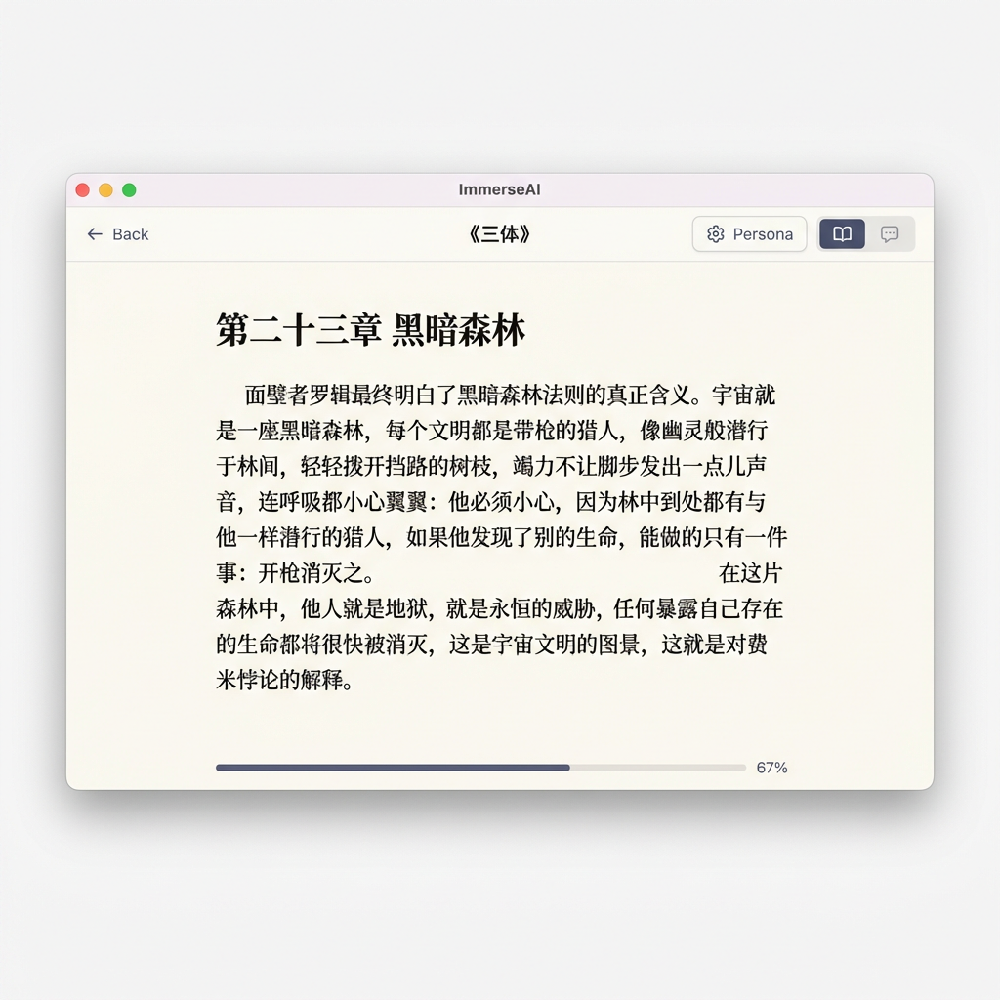

---

## Prompt 5：阅读页 — 对话模式 (Chat Mode)

```
Generate a high-fidelity UI screenshot of the "ImmerseAI" desktop application in Chat Mode, where the user is having an immersive conversation with a book character.

WINDOW FRAME: macOS-style, 1440×900.

LAYOUT:
- HEADER BAR (~48px):
  - Left: "← Back" in slate-500.
  - Center: "《三体》" in slate-900.
  - Right: "Persona" button (user-cog icon), and mode toggle — book icon (inactive, slate-300) and message icon (active, filled slate-900 with white icon). Current mode is "Chat".

- MAIN CONTENT (Chat Interface, full screen below header):
  A ChatGPT-style conversation interface, clean and spacious.

  Show 4 messages in the conversation:

  Message 1 — SYSTEM (subtle, centered, small text in slate-400):
  "You are now talking to 章北海 from《三体》"

  Message 2 — USER (right-aligned bubble):
  Light slate-100 background, rounded-2xl, slate-900 text.
  Content: "你作为面壁者，最初知道真相时是什么感受？"

  Message 3 — ASSISTANT (left-aligned):
  A small circular avatar showing "章" character in a slate-800 circle with white text. Name "章北海" in slate-700, bold, above the message.
  White background bubble with 1px slate-200 border, rounded-2xl.
  Content: "当我第一次理解黑暗森林法则时，我感到的不是恐惧，而是一种冷静的确认。作为军人，我早已习惯在最坏的假设下行动。真正让我难以承受的，是那种无法与任何人分享这份认知的孤独。"

  Below this message, a small CITATION BADGE:
  A clickable tag-like element with a link icon "📎", text "引用: 第23章 '黑暗森林' p.342" in a slate-100 background pill with slate-600 text, rounded-full. The badge has a subtle hover-ready appearance.

  Message 4 — USER:
  "如果重来一次，你还会做同样的选择吗？"

  Below all messages, show a typing indicator: three animated dots "..." with text "章北海 is thinking..." in slate-400.

- BOTTOM INPUT BAR (fixed, ~64px):
  A wide text input with rounded-xl border (slate-200), placeholder text "Say something to 章北海..." in slate-400. Send button on the right — a circle with arrow-up icon in slate-800 fill.

DESIGN STYLE: Clean ChatGPT-like interface with Notion's monochrome palette. User bubbles are right-aligned with slate-100 bg. Assistant bubbles are left-aligned with white bg and border. Generous spacing between messages. The citation badge is a distinctive feature — small, subtle, but clearly clickable. Overall mood: intimate, immersive, focused conversation.

OUTPUT: A single realistic desktop app screenshot.

```
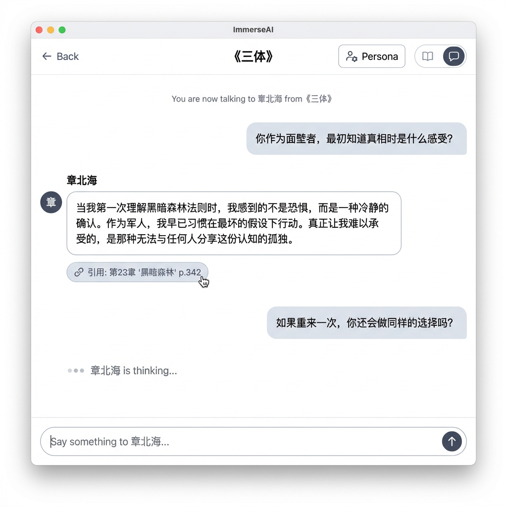

---

## Prompt 6：角色配置弹窗 (Persona Config Dialog)

```
Generate a high-fidelity UI screenshot of the "ImmerseAI" desktop application with a modal dialog overlay for character persona configuration.

WINDOW FRAME: macOS-style, 1440×900.

BACKGROUND: The Reader page is visible but dimmed with a dark semi-transparent overlay (black at 50% opacity), showing the chat interface blurred behind.

MODAL DIALOG (centered, ~520px wide, ~600px tall):
White background, rounded-xl corners, subtle shadow-lg. Thin 1px slate-200 border.

HEADER of dialog:
- Left: An emoji "🎭" followed by bold text "角色配置" (Persona Settings) in slate-900, 18px.
- Right: A small "×" close button in slate-400.

BODY of dialog (stacked form fields with 16px spacing):

Field 1 — "角色名称" (Character Name):
  Label in slate-700, 14px, semibold.
  Input field with slate-200 border, rounded-md, containing text "章北海" in slate-900.

Field 2 — "角色描述" (Description):
  Label in slate-700.
  Textarea (3 rows) with slate-200 border, containing: "三体中的军人角色，坚定的太空军事战略家，为人类未来做出了最艰难的选择。"

BUTTON: A prominent button "✨ 一键生成人设" (Auto-Generate Persona) — full width, slate-900 background, white text, rounded-md, centered. This is the primary action.

DIVIDER: A thin horizontal line with text "—— 生成的详细设定 ——" centered in slate-400, 12px.

GENERATED FIELDS (read-only appearance, slate-50 background):

Field 3 — "性格特征" (Personality):
  Text in slate-800: "冷静、果断、有远见。表面温和但内心极为坚定，善于隐藏真实意图。"

Field 4 — "说话风格" (Speech Style):
  Text: "简洁有力，带有军人气质。常用陈述句，很少使用感叹号。偶尔流露深沉的情感。"

Field 5 — "代表台词" (Key Quotes):
  Show 2 quoted lines in italic:
  "「自然选择，前进四。」"
  "「不要让人类的感情左右我们的判断。」"

FOOTER of dialog:
Two buttons right-aligned:
  1. "取消" (Cancel) — ghost button, slate-500 text, slate-200 border.
  2. "保存角色" (Save Persona) — filled button, slate-900 bg, white text.

DESIGN STYLE: shadcn/ui dialog style. Clean, form-focused. The auto-generated section has a slightly different background (slate-50) to indicate it's AI-generated content. All inputs use consistent rounded-md styling. Monochrome palette throughout.

OUTPUT: A single realistic desktop app screenshot with the modal overlay.

```
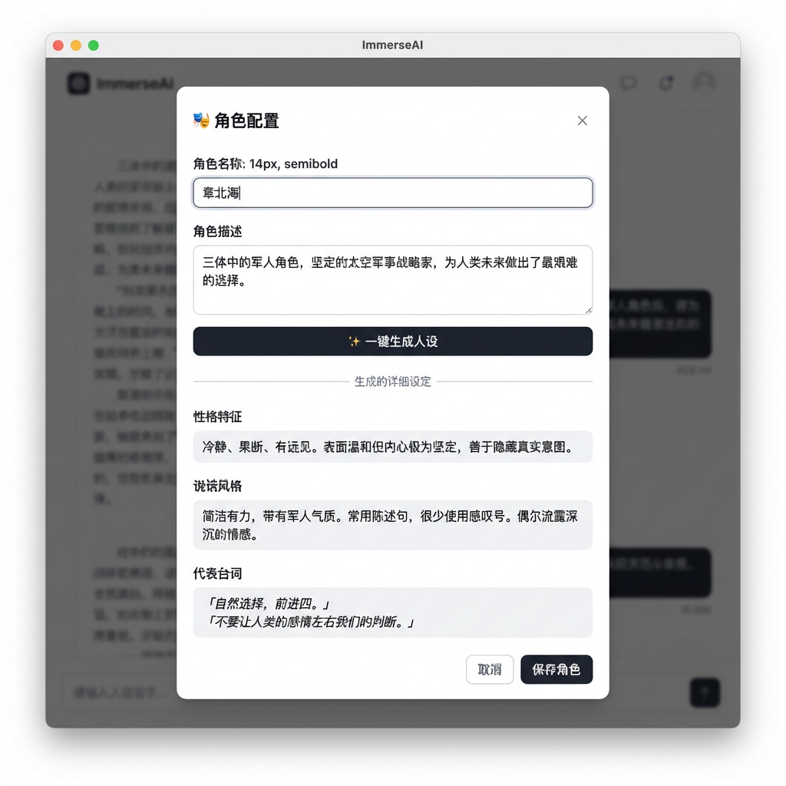

---

## Prompt 7：角色配置弹窗 — 正在生成中（Loading 状态）

```
Generate a high-fidelity UI screenshot of the "ImmerseAI" desktop app showing the Persona Config dialog in a loading state while AI generates character details.

WINDOW: macOS-style, 1440×900. Background dimmed.

MODAL (same size as Prompt 6):

TOP SECTION: Same as before — "角色名称" field filled with "罗辑", "角色描述" field filled with "三体中的面壁者，从玩世不恭的学者到拯救人类的英雄。"

THE BUTTON: "✨ 一键生成人设" is now in a disabled/loading state — slate-400 background, with a small spinning loader icon and text "正在分析书籍内容..." (Analyzing book content...) in white.

BELOW THE DIVIDER: The "generated fields" area shows a skeleton loading animation. Three blocks of content placeholders:
  - Each block is a rounded rectangle with animated shimmer effect (light gray gradient moving left to right, like a skeleton loader).
  - Three skeleton blocks of different widths (100%, 80%, 60%) simulating loading text.
  - A small progress text below: "正在从《三体》中检索角色信息... (3/5 个维度)" in slate-400, 12px.

FOOTER: Both buttons are disabled (grayed out) during generation.

DESIGN STYLE: Same Notion-minimal style. The skeleton loaders use slate-100 to slate-200 shimmer gradient. The loading state feels purposeful and informative — the user knows exactly what's happening.

OUTPUT: A single realistic desktop app screenshot with loading modal.

```
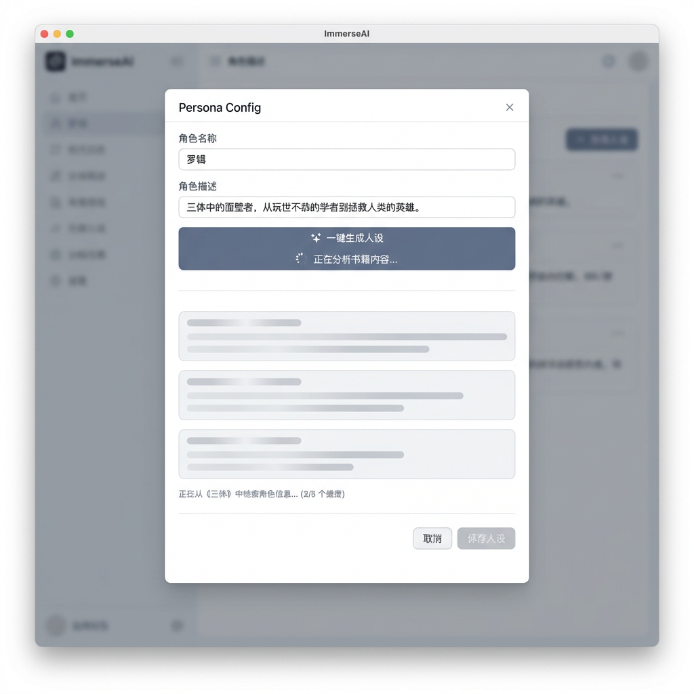

---

## Prompt 8：设置页面 (Settings Page)

```
Generate a high-fidelity UI screenshot of the "ImmerseAI" desktop application's Settings page.

WINDOW FRAME: macOS-style, 1440×900.

LAYOUT:
- LEFT SIDEBAR (~240px wide):
  White background with 1px slate-200 right border.
  Top: "← Back to Bookshelf" link in slate-500 with left arrow.
  Below: A vertical navigation menu with the following items, each with an icon and label:
    1. "🔑 API 配置" (API Settings) — currently active, slate-900 text with slate-100 background highlight.
    2. "📚 书架设置" (Bookshelf Settings) — inactive, slate-500 text.
    3. "🎨 外观" (Appearance) — inactive, slate-500 text.
    4. "ℹ️ 关于" (About) — inactive, slate-500 text.

- MAIN CONTENT (~1200px, right side):
  Section title: "API 配置" in slate-900, bold, 24px. Below: a subtitle "Configure your LLM provider for AI-powered conversations." in slate-500, 14px.

  CARD 1 — "LLM Provider" (模型提供商):
  White card with 1px slate-200 border, rounded-lg, padding 24px.
    - Label: "选择模型提供商" in slate-700, semibold.
    - A horizontal row of 4 selectable option cards:
      1. "DeepSeek" — currently selected (slate-900 border, checkmark icon)
      2. "Kimi (Moonshot)" — unselected (slate-200 border)
      3. "OpenAI" — unselected
      4. "Custom" — unselected
    Each option card is ~120px wide, rounded-md, with the provider name centered.

  CARD 2 — "API Key":
  White card.
    - Label: "API Key" with a small lock icon "🔒".
    - A password-style input field showing "sk-••••••••••••••••••" with a show/hide eye icon on the right.
    - Helper text below: "密钥将使用系统级加密安全存储" in slate-400, 12px, with a small shield icon.

  CARD 3 — "Model Settings":
  White card.
    - "Model Name" dropdown: showing "deepseek-chat" with a chevron-down.
    - "Base URL" input: "https://api.deepseek.com/v1"
    - "Temperature" slider: a horizontal slider from 0.0 to 1.0, currently at 0.7, with the value "0.7" displayed.
    - "Max Tokens" input: "2048"

  BOTTOM: A "Save Settings" button in slate-900 background, white text, right-aligned. Next to it, a "Test Connection" ghost button with slate-200 border.

DESIGN STYLE: Clean settings page like Notion's settings or Linear's preferences. Left sidebar navigation, right content area. Cards for grouping. All monochrome. Generous whitespace.

OUTPUT: A single realistic desktop app screenshot.

```
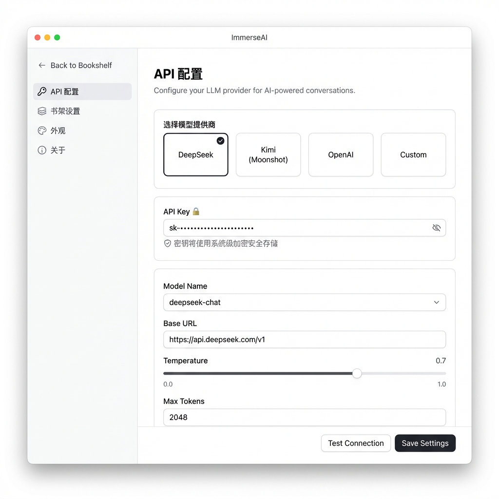

---

## Prompt 9：阅读页 — 引用跳转交互（Citation Jump）

```
Generate a high-fidelity UI screenshot of the "ImmerseAI" desktop application showing the Reader View in READ MODE with a highlighted citation passage.

WINDOW FRAME: macOS-style, 1440×900.

LAYOUT:
- HEADER: Same as Read Mode (Prompt 4). Mode toggle shows "Read" as active.

- MAIN CONTENT: The EPUB reading area with Chinese text. A centered reading column (~700px wide).

  The passage displays several paragraphs of text. One specific paragraph is HIGHLIGHTED with a soft yellow/amber background (amber-100, very subtle) and has a thin left border in amber-400 (3px solid). This highlighted paragraph reads:

  "「自然选择，前进四。」章北海下达了这个改变人类命运的命令。在那一刻，他的眼神没有任何犹豫，仿佛这个决定早在多年前就已经做出。"

  Above the highlighted paragraph, a small floating TOOLTIP/BADGE appears:
  A tiny card with rounded corners, slate-800 background, white text: "💬 来自与章北海的对话 · 点击返回" (From conversation with Zhang Beihai · Click to return). This indicates the user jumped here from the Chat mode.

- A subtle scroll indicator arrow on the right edge suggests the user was scrolled to this specific position.

DESIGN STYLE: Same calm reading environment as Prompt 4, but with the citation highlight adding a warm touch. The yellow highlight is very subtle — not distracting, just guiding attention. The floating tooltip is small and will disappear after a few seconds.

OUTPUT: A single realistic desktop app screenshot showing the citation highlight interaction.

```
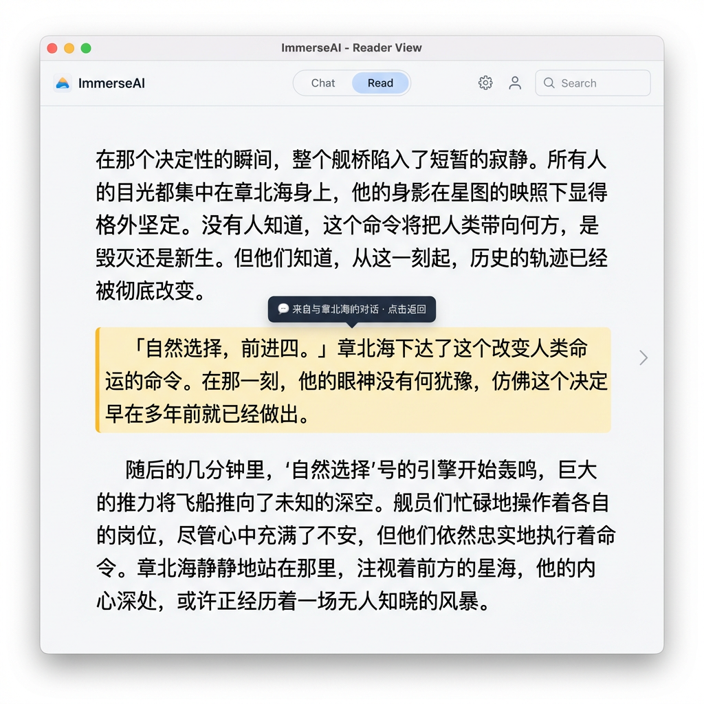

---

## Prompt 10：索引进度状态（Book Indexing Progress）

```
Generate a high-fidelity UI screenshot of the "ImmerseAI" desktop application showing a book being indexed (vector-embedded) for the first time.

WINDOW FRAME: macOS-style, 1440×900.

LAYOUT:
- HEADER: Same as Read Mode header. Book title "《百年孤独》" in center.

- MAIN CONTENT: Instead of the reading area, a centered card (~500px wide) showing the indexing progress:

  TOP: A brain icon "🧠" in 48px, centered.

  TITLE: "正在建立书籍索引" (Building Book Index) — slate-900, bold, 20px, centered.

  SUBTITLE: "首次打开需要对书籍进行语义分析，以便后续的智能检索和角色对话。" — slate-500, 14px, centered, max-width 400px.

  PROGRESS BAR: A horizontal bar, full width of the card. Background slate-200, filled portion in slate-800, currently at 42%. Rounded-full corners.

  PROGRESS DETAIL: Below the bar, two lines of small text:
    "42% — 正在向量化第 3/7 章..." in slate-600, 13px.
    "预计剩余时间: ~2 分钟" in slate-400, 12px.

  STEP INDICATORS: Below, show 4 steps in a horizontal row:
    1. "✅ 解析文本" (Parse) — green checkmark, completed.
    2. "✅ 文本切分" (Chunk) — green checkmark, completed.
    3. "⏳ 向量化" (Embed) — spinner/hourglass, in progress, slate-900 bold text.
    4. "⬜ 存储索引" (Index) — gray, pending.

  BOTTOM NOTE: "索引完成后将自动缓存，下次打开秒速加载 ⚡" in slate-400, 12px, italic.

DESIGN STYLE: Centered progress card, informative but not overwhelming. The step indicators give transparency into what's happening. Monochrome palette with green only for completed checkmarks. The mood is "your AI is getting smarter about this book."

OUTPUT: A single realistic desktop app screenshot.

```
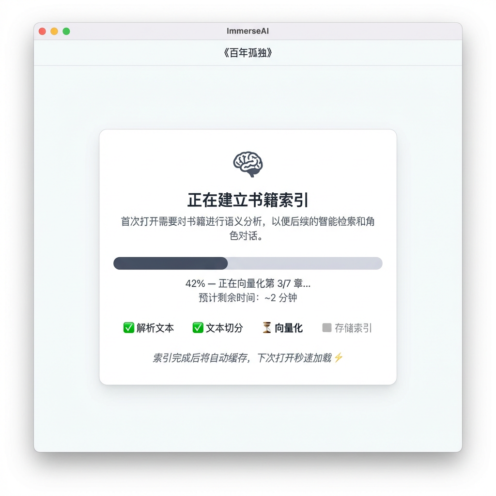

---

## Prompt 11：全局概览 — 四屏横向展示（Portfolio Shot）

```
Generate a single image showing FOUR desktop application screenshots laid out horizontally in a 2×2 grid on a light gray (#f1f5f9) background. Each screenshot is a different view of the "ImmerseAI" application. Each has a macOS window frame with traffic light buttons.

SCREEN 1 (top-left) — BOOKSHELF:
A book grid dashboard showing 6 book cards with colored covers in 2:3 ratio. Bottom has a chat input bar. Header shows "ImmerseAI" logo. Clean white background, Notion-minimal style.

SCREEN 2 (top-right) — READER:
An EPUB reading view with centered Chinese text, clean typography, 18px font, generous line spacing. Chapter title "第二十三章" at top. Thin header with back button and mode toggle.

SCREEN 3 (bottom-left) — CHAT:
A ChatGPT-style conversation with a book character. 3 message bubbles — user on right (slate-100), AI on left (white with border) showing Chinese text. A citation badge below one AI message. Input bar at bottom.

SCREEN 4 (bottom-right) — PERSONA CONFIG:
A modal dialog overlay showing persona settings form. Character name "章北海", description textarea, an "Auto-Generate" button, and generated personality details below a divider.

Each screenshot has a small caption below in dark gray, 14px:
"Bookshelf", "Reader", "Chat", "Persona Config"

DESIGN STYLE across all screens: Consistent Notion-inspired minimalism. Monochrome slate palette. Inter font. No gradients, minimal shadows. The 4 screens should look cohesive — clearly the same application.

OUTPUT: A single composite image showing all 4 screens in a neat 2×2 grid arrangement, suitable for a portfolio or README showcase.

```
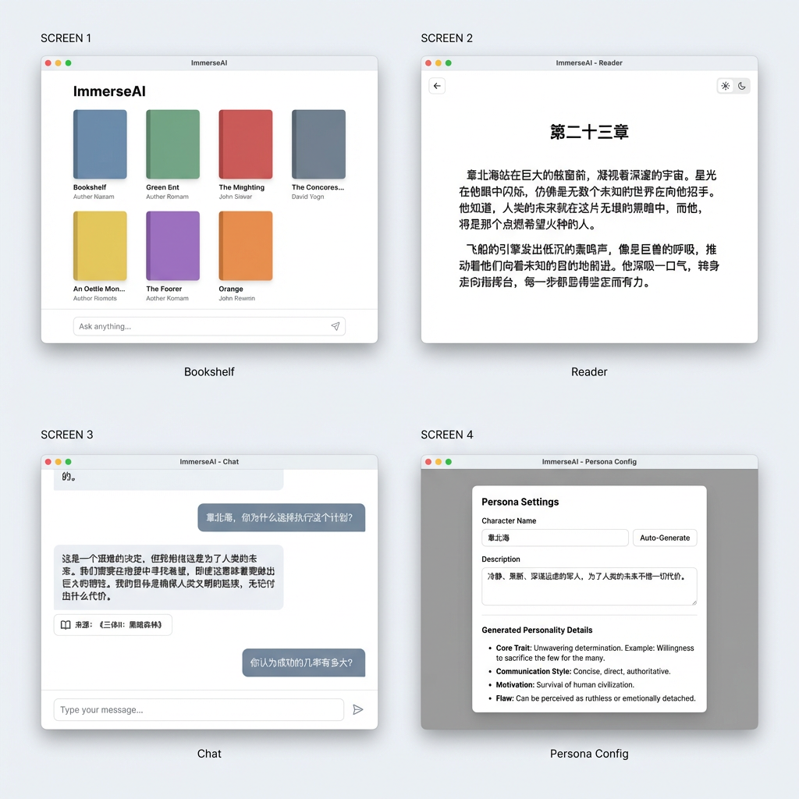

---

## 🗂️ Prompt 使用指南

| Prompt #      | 页面 / 状态          | 用途                     | 优先级       |
| ------------- | -------------------- | ------------------------ | ------------ |
| **P1**  | 书架 — 空状态       | 首次启动引导设计参考     | P1           |
| **P2**  | 书架 — 已加载       | 核心书架页开发参考       | **P0** |
| **P3**  | 书架 — Agent 执行中 | Librarian Agent 交互参考 | P1           |
| **P4**  | 阅读页 — Read Mode  | EPUB 阅读器开发参考      | **P0** |
| **P5**  | 阅读页 — Chat Mode  | 核心对话界面开发参考     | **P0** |
| **P6**  | 角色配置弹窗         | Persona 功能开发参考     | **P0** |
| **P7**  | 角色配置 — Loading  | 加载状态设计参考         | P2           |
| **P8**  | 设置页面             | 设置功能开发参考         | P1           |
| **P9**  | 引用跳转高亮         | 整合阶段交互参考         | P1           |
| **P10** | 索引进度             | RAG 索引状态 UI 参考     | P1           |
| **P11** | 四屏概览             | README / Portfolio 展示  | P2           |

### 💡 使用建议

1. **先生成 P2、P4、P5、P6** — 这四张图覆盖了你最核心的三个页面状态，是 Phase 2-4 开发的直接视觉参考
2. **把生成的图片放到项目的 `docs/design-reference/` 目录下**，方便开发时对照
3. **在每个 OpenSpec change 的 proposal 中引用对应的设计图**，让 AI 编码时有视觉锚点

